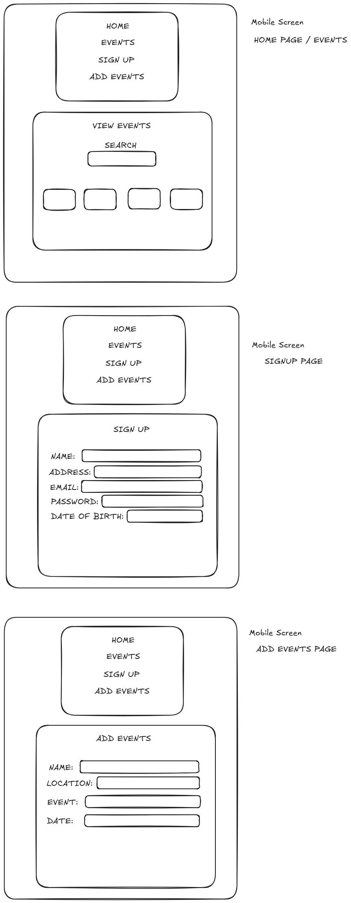

<h1>#Events Platform</h1>

(1) I created a new directory in the terminal entitled 'events_platform' and then proceeded to cd into same directory.   
(2) I created a new REACT project in the terminal by using npm create vite@latest my-react-app -- --template react
  
(3) I created a new folder called 'Components' and created a new file called 'Header.jsx', I wrote code in the file to test the output; also created code in the App.jsx file.  
(4) I created a new GItHub repository entitled 'events_platform' and made an initial commit.  
(5) I installed playwright to add testing to my site (in the terminal npm init playwright).  
(6) I wrote a test to check the title of the website.  
(7) I wrote code to the main section to output an Event Data API, the one I used is: https://app.ticketmaster.com/discovery/v2/events.  
(8) I wrote another test to test the API is ouputting the correct information (both tests passed).  
(9) I created a sign up page for the user with input fields including 'name', 'password', 'address', 'email' and 'date of birth'.   
(10) I wrote a new test to validate the sign up form.   
